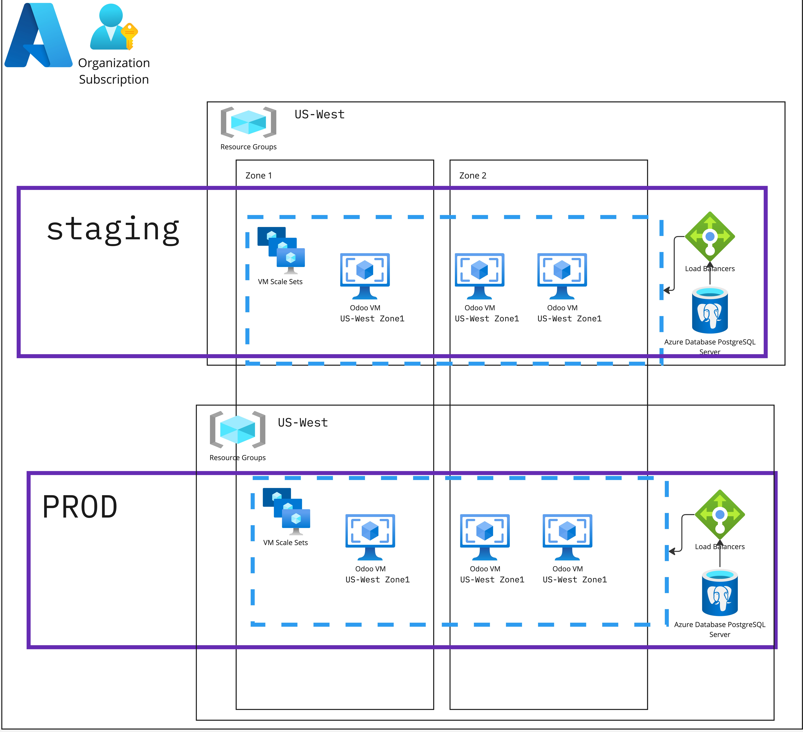

# IS214 Enterprise Solutions Management

Infrastructure - IAC code to deploy our architecture on Azure 
Application - Odoo16 application, coupled with a backup from 14/03/24 2211hrs.

 * Our solution employs Azure services that aim to provide high availability, fault tolerance, and 
 reliability.

 * We employ Azure Virtual Machine Scale Sets to help auto scale our environment, in the event of a high-load, as well as implementing load balancers to help manage that capacity.

 * Finally, our database solution is hosted on a highly available, and reliable Azure Database for Postgres.

## Additional Tools Employed:
- Terraform was used to speed up infrastructure work; as well as to improve maintainability.
- Docker was also utilized to help containerize our Odoo Application.

Infrastructure:

Devops Approach:

### Improvements to be made:
- Storing of terraform state using blob storage (this is not possible with a student email, and has to be done with an individual access account on Azure - due to the requirement of needing Microsoft Entra.)